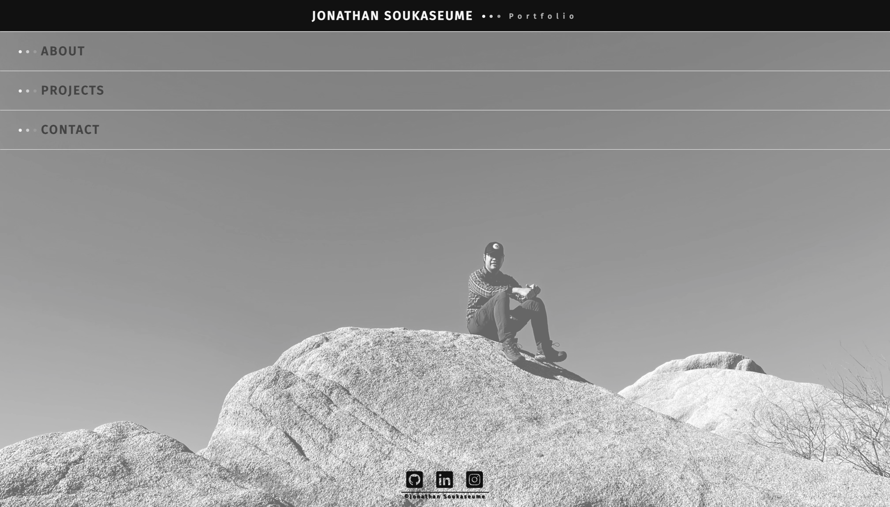
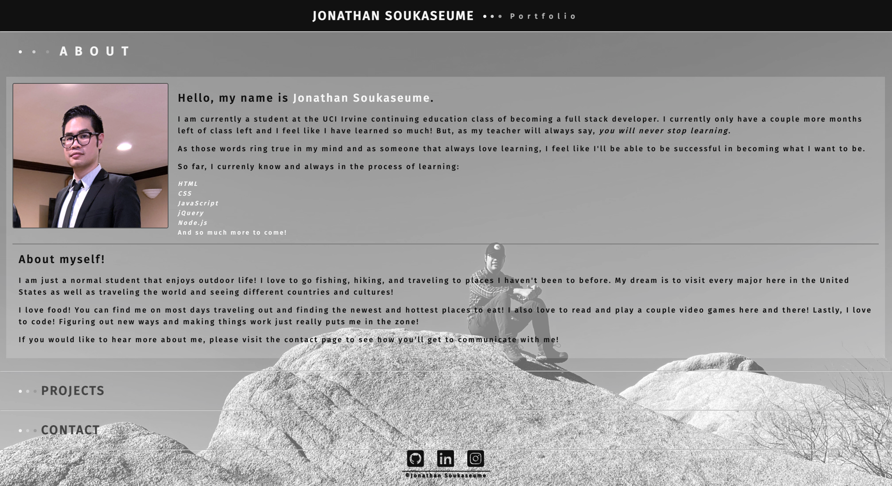
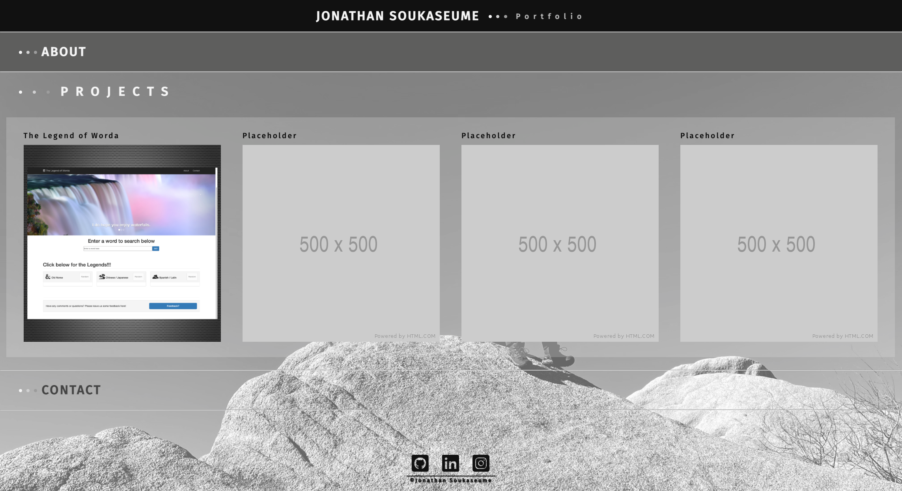
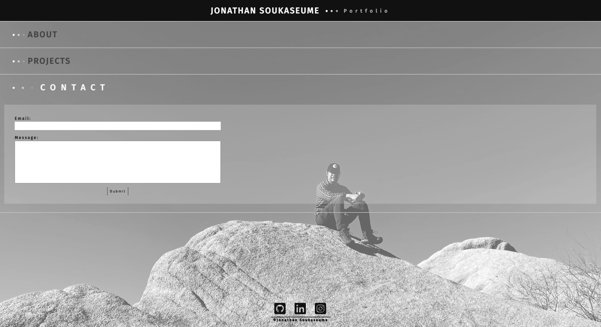

# Portfolio

## Jonathan's Updated Portfolio
To update existing portfolio, but instead, I created a new portfolio page from scratch. Everything is on one page: About, Projects and Contact form. Updated project page with the first project done. Also added a couple of placeholders for future projects to be done.

## Links
[Link to github](https://github.com/sksmejn/Portfolio)  
[Link to Portfolio](https://sksmejn.github.io/Portfolio/)

## Screenshots

### Updates
Updated February 05, 2021